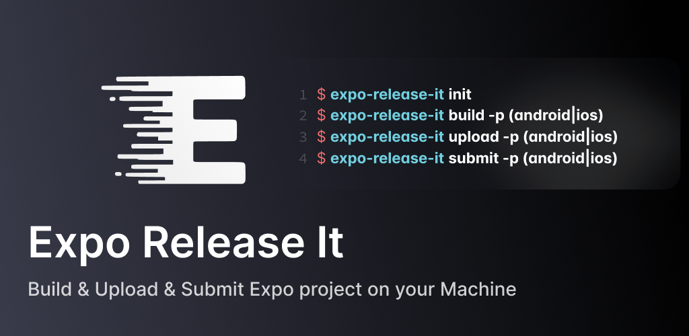

# Expo Release It ⚡️



Opinionated Expo CICD workflow CLI for building & uploading & submitting Expo projects on your machine

> [!CAUTION]
> This project is under development.

# Features

- 🎉 No **EAS**
- 🩵 No headaches when understanding and managing **keys and credentials**
- 🧩 Manage and sync **store metadata** easily
- 🌍 Works with [Expo CNG](https://docs.expo.dev/workflow/continuous-native-generation/) mode (also available in non-CNG environments)
- 📦 Build artifacts **locally** (`apk`, `aab`, `ipa`)
- 🚀 Upload artifacts to Google Play Console Internal Testing Track and iOS TestFlight
- ✅ Submit releases for review

# Why?

**You don't need Expo EAS and to understand how it works in most small projects and our machine is much faster than using the cloud.**

<details>
  <summary>Full Details</summary>

Expo EAS is convenient, but it requires additional configuration files, console setup, and a conceptual understanding of Over-The-Air (OTA) updates. Also, builds must be performed on EAS Cloud, which is not free and can be slow.

While EAS is useful for larger teams, if you are developing alone or with just a few people and question the need for such a process, `expo-release-it` is the answer.

Based on years of experience developing with React Native, I encourage a more traditional approach: build APK, AAB, and IPA files locally, upload them to each platform’s store testing track, and request reviews—without worrying about binary versions, OTA update versions, or branch management.

This approach is much faster, simpler, and, most importantly, allows you to take full advantage of your computer’s fast CPU.

OTA updates are a powerful tool in React Native, but to fully take advantage of them, you need a self-hosted CDN server, a version management console both in the cloud and inside the app, and you have to separately manage binary versions and bundle versions—all of which introduce significant complexity and semantic overhead that often outweigh the benefits of implementing OTA updates. Furthermore, due to a general lack of deep understanding about OTA updates, issues like native library version mismatches can occur frequently, so OTA updates are excluded by default.

I’m also a big fan of OTA updates, and I’ve enjoyed a lot of efficiency when working in larger teams, but it always required setting up many supporting systems in advance.

`expo-release-it` is a CLI tool that encapsulates the know-how I have gained over years of automating build and review processes.  
Internally, it ports and integrates tools like Fastlane and Match to automate native binary builds and review requests.

Therefore, this tool enforces an opinionated versioning, build, and review request workflow.  
However, once you understand this approach, your app deployment process will become significantly faster.

</details>

# Structurual Requirements

- `Version Code(Android)` and `Builder Number(iOS)` are the same.
- All Keys, Credentials(except iOS certificates & provisioning profiles served in Github separately) are stored in VCS

# Getting Started

## 1. Ruby, Bundler

`expo-release-it` requires `bundler` of ruby is available in your environment to run `Fastlane` internally.

If not, set up your environment so that `ruby` and `bundler` are available by following [Ruby Install Guide](https://www.ruby-lang.org/en/downloads/) 

## 2. Prepare Keys & Credentials

`init` command generates sample key files structure in `expo-release-it/key`. They are **noob files** and you must replace file contents.

> [!IMPORTANT]
**You must prepare all required key files in `expo-release-it/key` exactly the same filenames.**

### `android_play_console_service_account.json`

Google Play Console actions require authentication using Google Service Account.

You can issue new Google Play Service Account by following Guide
and prepare `json` file.

- [How to Get Your Google Play JSON Key](https://help.radio.co/en/articles/6232140-how-to-get-your-google-play-json-key)

### `android_release.keystore`

Prepare your android release keystore file for **uploading** and **signing** Android build artifacts.

Additional passwords, alias will be prompted during the `init` command and be stored in `keyholder.json`.

- [Keystore generation with Android Studio](https://developer.android.com/studio/publish/app-signing.html#generate-key)
- [Keystore generation with CLI](https://gist.github.com/henriquemenezes/70feb8fff20a19a65346e48786bedb8f)

### `ios_app_store_connect_api_key`

App Store Connect actions require authentication using App Store Connect Api Key(.p8) 

Additional `issuer_id`, `key_id` values will be prompted during the `init` command and be stored in `keyholder.json`

- [Guide](https://www.revenuecat.com/docs/service-credentials/itunesconnect-app-specific-shared-secret/app-store-connect-api-key-configuration)
- [Apple Docs Guide](https://developer.apple.com/documentation/appstoreconnectapi/creating-api-keys-for-app-store-connect-api)

## 3. Create & Configure app on the stores as much as possible

Create and configure your application in Google Play Console & App Store Connect as many as possible.

You'd have to fill your key & credentials information using `init` command and pull store metadatas using `pull` command later.

You would need to upload & publish your first artifact, release manually at first.

## 4. Set binary version in expo config file.

The following buildNumber, versionCode format `ABBBCCC` is not mandatory but recommended for readability. 

If your expo config file is `app.json`, then set like the following.

```json
{
  "expo": {
    "version": "1.2.3",
    "ios": {
      "buildNumber": "1002003",
    },
    "android": {
      "versionCode": 1002003,
    },
  }
}

```

If your expo config file is `app.config.(js|ts|mjs|cjs)`, then set like the following.

```typescript
import type { ExpoConfig, ConfigContext } from 'expo/config';
const VERSION_NAME = '1.2.3'; // VERSION_NAME variable is required.
const VERSION_CODE = 1002003; // VERSION_CODE variable is required.

export default ({ config }: ConfigContext): ExpoConfig => {
  return {
    ...config,
    version: VERSION_NAME,
    ios: {
      buildNumber: VERSION_CODE + '',
    },
    android: {
      versionCode: VERSION_CODE,
    },
  };
};

```

## 5. Update `.gitignore`

```gitignore
# Expo Release It

expo-release-it/.temp
android/vendor/bundle
ios/vendor/bundle
!*.jks
!*.p8
!*.keystore
```

# Usage

```shell
npx expo-release-it (init|bump|pull|build|upload|submit) [options]
```

All commands are powered by [Commander.js](https://github.com/tj/commander.js?) means you can query all available options with `--help` or `-h`.

## init

**Configure resources and environment**

```shell
npx expo-release-it init
```

The `init` command asks you for many form fields, and the information is saved in `expo-release-it/keyholder.json` in your project.

Even after running `init`, you can manually edit `keyholder.json`, and all subsequent commands will use the updated values.

## bump

**Bump binary release patch version with modifying expo config file**

```shell
npx expo-release-it bump
```

## pull

**Download metadatas from stores**

```shell
npx expo-release-it pull
```

## build

**Build artifacts (apk, aab, ipa)**

```shell
npx expo-release-it build
```

## upload

**Upload artifact to play console internal test track(android) and testflight(ios)**

```shell
npx expo-release-it upload
```

## submit

**Submit Google Play Console & App Store Connect Review with latest testing track**

```shell
npx expo-release-it submit
```

# About Security

That’s right. You might be wondering whether storing files like .p8, keystore files, or key values in version control is truly secure.
In conclusion, if you’re using a private repository, you can consider it to be somewhat safe.

For example, Fastlane Match also uses OpenSSL encryption, but it still stores certificates and profiles in a private Git repository.

While you could implement additional security policies, I haven’t taken any extra measures for now.
If you need further encryption, you can build middleware in your pipeline that runs expo-release-it so that everything in the expo-release-it directory goes through encryption and decryption processes.

Any suggestions are welcome.

# Troubleshooting

# Licenses

- See [LICENSE](/LICENSE)

---

<p align="center">
  <a href="https://mjstudio.net/">
    
  </a>
  <p align="center">
    Built and maintained by <a href="https://mjstudio.net/">MJ Studio</a>.
  </p>
</p>
