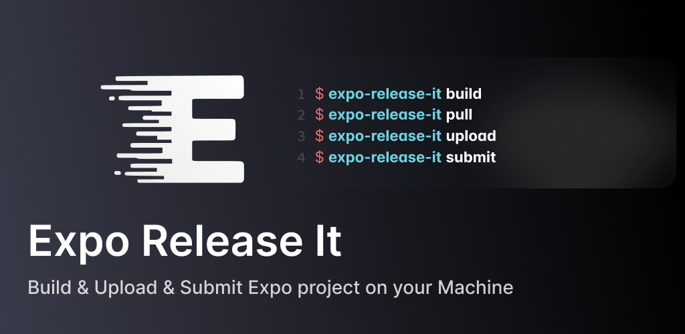

# Expo Release It ⚡️

Opinionated Expo CICD workflow CLI for building & uploading & submitting Expo projects on your machine

# Documentation

Visit our [Documentation Site](https://expo-release-it.mjstudio.net)

# Features

- 🎉 No **EAS**
- 🩵 No headaches when understanding and managing **keys and credentials**
- 🧩 Manage and sync **store metadata** easily
- 🌍 Works with [Expo CNG](https://docs.expo.dev/workflow/continuous-native-generation/) mode (also available in non-CNG environments)
- 📦 Build artifacts **locally** (`apk`, `aab`, `ipa`)
- 🚀 Upload artifacts to Google Play Console Internal Testing Track and iOS TestFlight
- ✅ Submit releases for store review

# Licenses

- See [LICENSE](/LICENSE)

---

  
  

    Built and maintained by <a href="https://mjstudio.net/">MJ Studio</a>.
  

